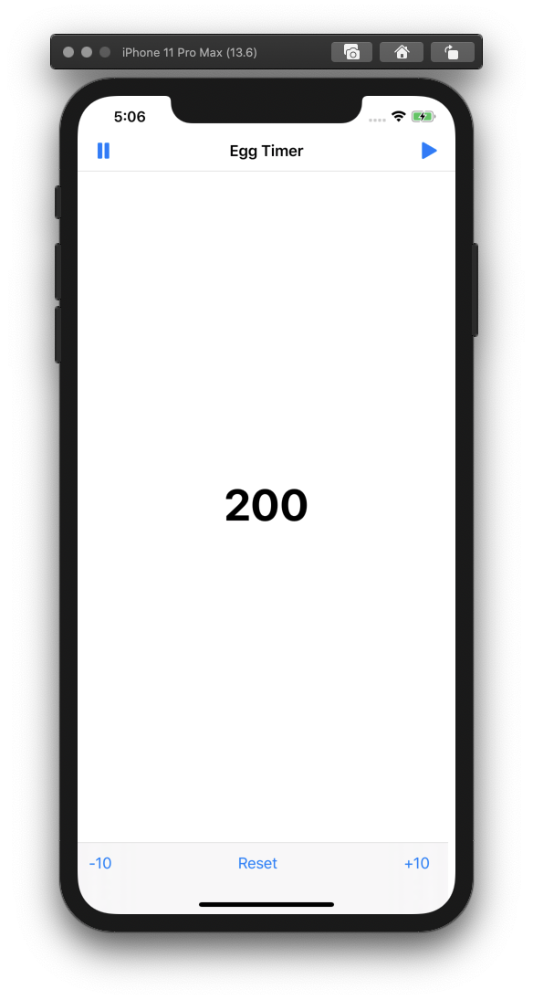
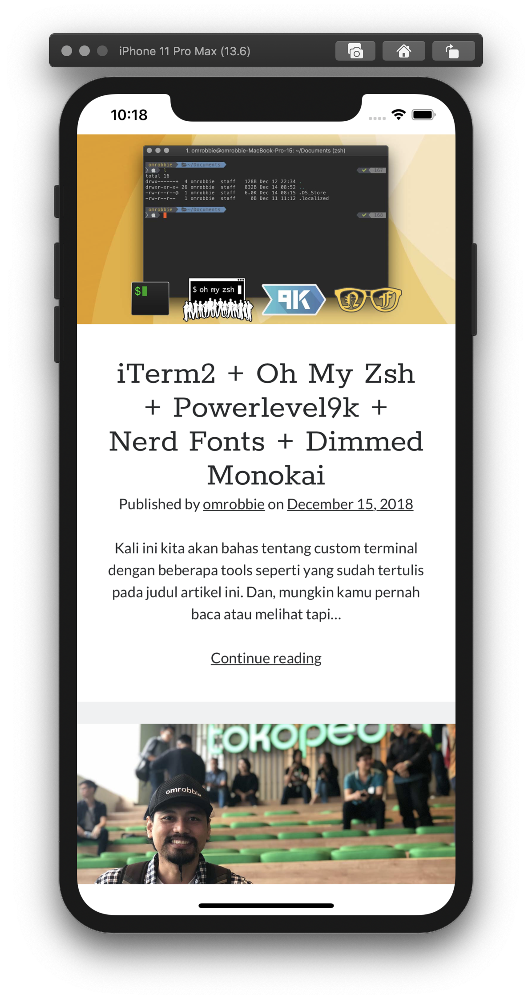

# the-complete-ios-12-swift-developer-course
Materi selengkapnya ada di https://www.udemy.com/course/ios-12-developer-course. Semua materi sudah bisa dijalankan menggunakan Swift 5.

### 1. Cat Years
Learn how to use IBOutlet and IBAction. 

### 2. Is It Prime?
Learn how to create adaptive layout with AutoLayout. 
&nbsp;
&nbsp;
&nbsp;

### 3. Egg Timer
Learn about Navigation Bar, Toolbar, and Timer. 
&nbsp;
&nbsp;

### 4. Times Tables
Learn about TableView and Slider. 
&nbsp;
&nbsp;
&nbsp;

### 5. Whats My Number?
Learn about UserDefaults. 
&nbsp;
&nbsp;

### 6. To Do List
Learn about UserDefaults, Tab Bar. 
&nbsp;
&nbsp;
&nbsp;

### 7. Web Content
Learn about Web View, WebKit. 
&nbsp;

### 8. Whats The Weather?
Learn about URLSession, JSONSerialization. 
&nbsp;
&nbsp;

### 9. Tic Tac Toe
Learn about AutoLayout, array IBOutlet, UIImage. 
&nbsp;
&nbsp;

### 10. Location Aware
Learn about CoreLocation, CLLocationManager, get address information from Geocoder. 
&nbsp;
&nbsp;

### 11. Memorable Places
Learn about CoreLocation, MapKit, add new Annotation with long press on the map. 
&nbsp;
&nbsp;

### 12. Back to Bach
Learn about AVFoundation. 
&nbsp;

### 13. Shake and Swipe Example
Learn about Motion Detection (shake), SwipeGestureRecognizer (swipe left and right). 
&nbsp;
&nbsp;
&nbsp;

### 14. Login Demo
Learn how to save and load data from CoreData. 
&nbsp;
&nbsp;

### 15. Blue Tracker
Learn abou CoreBluetooth, scan for peripheral. 
&nbsp;
